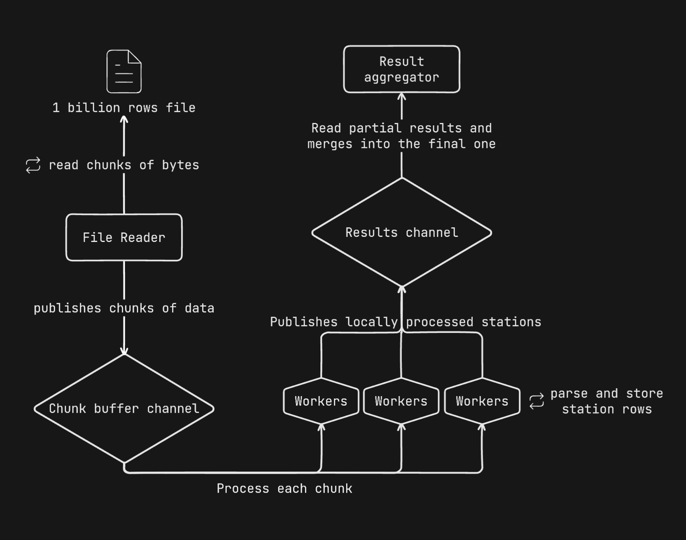
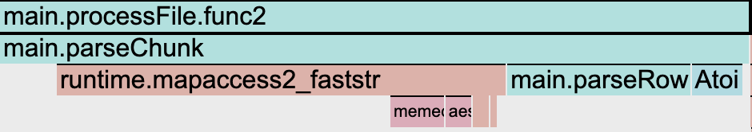

# 1 Billion Row Challenge

The One Billion Row Challenge -- A fun exploration of how quickly 1B rows from a text file can be
aggregated with ~~Java~~ Go

[Link to the original challenge](https://github.com/gunnarmorling/1brc)

## Attempt #1 - Got it working

First working version. No optimizations, concurrency or anything fancy.

Added tests and profiling to prepare for second attempt.

### Results

- 220.42s

### Code state

[Release](https://github.com/Pedr0Rocha/1-billion-row-challenge/releases/tag/v1.0)

[Code](https://github.com/Pedr0Rocha/1-billion-row-challenge/tree/v1.0)

## Attempt #2 - First improvements + Fixes

After adding pprof to the program, it is clear that scanning **each line** using
`bufio` `Scanner` is not ideal. Pprof shows that we are spending ~80% of the time on the `read` `syscall`.

To solve this, we can try ingesting more rows per read by increasing the buffer size and
drastically reduce the number of `read` calls. Assuming that we have an avg. of 16 bytes per row, setting
the buffer size to `16 * 1024 * 1024` should be enough to read ~1M rows at once.

However, this improvement introduced a new issue. Incomplete rows for each chunk read or "leftover".

Since we are not reading each line anymore, we don't know where our buffer will end up
at when reading the main file. So the following situation happens very often:

**Input:** `42 bytes`

```bash
Juruá;95.7
Popunhas;-99.7
Imperatriz;50.4
```

**Buffer size:** `32 bytes`

```bash
Juruá;95.7
Popunhas;-99.7
Imper
```

**Leftovers**

```bash
Imper
```

To solve this issue, we can either keep reading the file until we find a new line or EOF, or
backtrack the current buffer to the last new line. This attempt implements the later. Continuing the example
above:

The last `\n` found is here: `Popunhas;-99.7`

```bash
Juruá;95.7
Popunhas;-99.7 <--HERE---
Imper
```

So the processed chunk will be:

```bash
Juruá;95.7
Popunhas;-99.7
```

In the next read, we have `atriz;50.4`. We will append it to the leftover from the last iteration and get:

Leftover + next read = new current buffer

`Imper` + `atriz;50.4` = `Imperatriz;50.4`

_note: using this strategy, the buffer chunk size can never be less than a complete row. Otherwise
it gets stuck trying to backtrack to the last new line._

### Results

- 173.05s

_Previous best was 220.42s_

### Code state

[Release](https://github.com/Pedr0Rocha/1-billion-row-challenge/releases/tag/v2.0)

[Code](https://github.com/Pedr0Rocha/1-billion-row-challenge/tree/v2.0)

## Attempt #3 - Parser to extract data from the bytes

The `read` `syscall` is now gone from the flamegraph, revealing the new performance killers.
`ParseFloat` from our measurement parsing and `WriteByte` from our string builder that extracts the data.

To improve it, we are going to use integers instead of float and only convert it to float
as the last operation to print it out. As for the `WriteByte`, we can write our own parser
for the resulting buffer and try to optimize it.

General improvements were also implemented as they would show up in pprof, such as unnecessary
assignments of `stationData` and bytes to string convertion.

At this level, `string(myBytes)` costs a lot and makes a big difference. After some research, we can
implement a more efficient way of doing it.

```go
func bytesToString(b []byte) string {
	// gets the pointer to the underlying array of the slice
	pointerToArray := unsafe.SliceData(b)
	// returns the string of length len(b) of the bytes in the pointer
	return unsafe.String(pointerToArray, len(b))
}
```

After all those improvements, we have a clear direction on where to improve next.

- We stopped converting to float, but we still convert to int, which is taking some time.

```bash
3.57s  measurementInt, _ := strconv.Atoi(bytesToString(measurement))
```

- Parsing the `resultBuffer` is too expensive, specially when trying to skip the `'.'` to make
  our conversion to int easy.

```bash
21.03s  newBuffer, stationName, measurement := parseBufferSingle(resultBuffer)
```

- This was a very unpleasant surprise, the map lookup is extremely slow.

```bash
38.53s  data, exist := stations[station]
```

And of course, we are still waiting for the resultBuffer to be parsed to continue reading from
the file. This can be improved by parsing pieces of the buffer at the same time using go routines
and merge the result somewhere.
But I'll try to improve the linear solution as much as possible before paralelizing the workload as
it will become more complex.

### Results

- 77.08s

_Previous best time was 173.05s._

### Code state

[Release](https://github.com/Pedr0Rocha/1-billion-row-challenge/releases/tag/v3.0)

[Code](https://github.com/Pedr0Rocha/1-billion-row-challenge/tree/v3.0)

## Attempt #4 - From helper functions to a more manual approach

From those three problems from attempt #3, I could only tackle the parsing of the result buffer.
It was very expensive to use `bytes.Index` to find the next `;`. Iterating over the buffer
and cutting it manually reduced the time spent in this function from 21.03s to ~13.00s.

Another small improvement was to stop appending the chars to build the measurement and only
use indexes to extract it from the buffer while cutting the `.`. This saved us ~3.00s

There is still some work to do when parsing the row. We are copying and passing a lot of
bytes around when we could try to return the indexes representing the interval where the
main buffer should be cut to extract the correct data.

I did some research on how to solve the map lookup issue, with no success. We have some alternatives
to explore. Implementing our own hash to build the map key, using an int as key and check if it would
improve something or use a Swissmap. But I will avoid to use external libs for this challenge, so
unless I can implement a simple version of the Swissmap, I will skip it.

Now our biggest problems are map lookup, and, of course, all the waiting. Since I'm still not
sure how to move forward with the map key, it's time to spin up some go routines and kill all the
waiting.

### Results

- 62.31s

_Previous best time was 77.08s._

### Code state

[Release](https://github.com/Pedr0Rocha/1-billion-row-challenge/releases/tag/v4.0)

[Code](https://github.com/Pedr0Rocha/1-billion-row-challenge/tree/v4.0)

## Attempt #5 - Workers for the rescue

Finally, it's concurrency time!

The concurrency pipeline has several elements that are connected to each other:

`chunk buffer channel` -> receives all the data read from the main file in chunks

`results channel` -> receives the maps produced by our workers

`file reader + chunk generator go routine` -> responsible for reading from the file by chunks,
handling the leftovers and pushing the result buffer to the `chunk buffer channel` to be processed.
It also manages the closing of the `chunk channel` and `results channel`.

`parse chunk workers` -> the workers read from the `chunk buffer channel` and process each chunk
to extract all the stations contained inside of the chunk. It reads until the `chunk buffer channel`
gets closed, which is right after the `file reader` finds EOF and pushes the last chunk.

To produce the final result, we also need a reader for the `results channel` that will aggregate
all the data produced by the workers. Since we will be writing the aggregate data in alphabetical order and
in the same slice, some serious locking would have to be put in place to avoid race conditions, making this piece
not very concurrency friendly.

I failed to draw a markdown table to explain this properly, so here's a diagram:



### Results

- 10.81s

_Previous best time was 62.31s._

### Code state

[Release](https://github.com/Pedr0Rocha/1-billion-row-challenge/releases/tag/v5.0)

[Code](https://github.com/Pedr0Rocha/1-billion-row-challenge/tree/v5.0)

## Attempt #6 - WIP

Great! We managed to get to ~10 seconds.

But of course, we still have some work to do.


